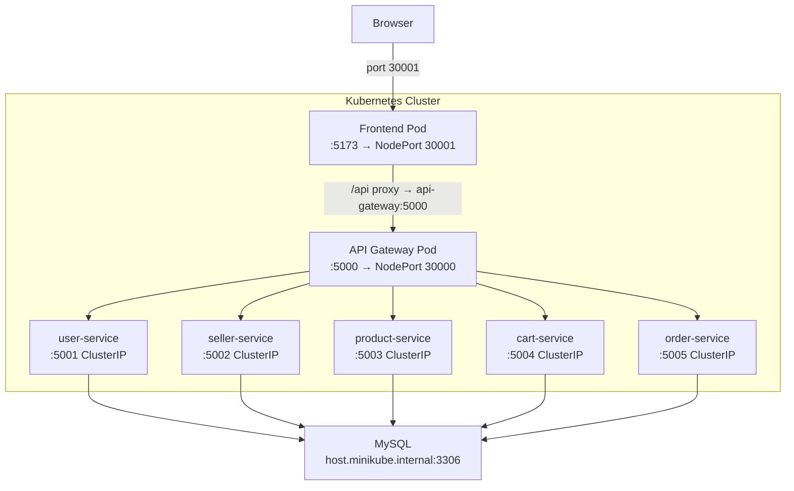

# Kubernetes Integration - Final Walkthrough

## What Was Built

A complete Kubernetes setup for the e-commerce microservices application, layered on top of the existing Jenkins + Ansible + Docker CI/CD pipeline.

## Files Created

| File | Purpose |
|------|---------|
| [deploy.sh](file:///home/jils-patel/spe-project/k8s/deploy.sh) | One-time setup script — reads `.env`, generates config/secret, deploys everything |
| [03-services.yaml](file:///home/jils-patel/spe-project/k8s/03-services.yaml) | ClusterIP services for 5 backend microservices |
| [04-gateway-service.yaml](file:///home/jils-patel/spe-project/k8s/04-gateway-service.yaml) | NodePort for API Gateway (port 30000) |
| [05-frontend-service.yaml](file:///home/jils-patel/spe-project/k8s/05-frontend-service.yaml) | NodePort for Frontend (port 30001) |
| [06-backend-deployments.yaml](file:///home/jils-patel/spe-project/k8s/06-backend-deployments.yaml) | Deployments for all 5 backend services with RollingUpdate |
| [07-gateway-frontend-deployments.yaml](file:///home/jils-patel/spe-project/k8s/07-gateway-frontend-deployments.yaml) | Deployments for API Gateway and Frontend with RollingUpdate |

> [!NOTE]
> `01-config.yaml` and `02-secret.yaml` are **generated locally** by `deploy.sh` from your `.env` file. They are gitignored and never pushed to GitHub.

## Git Commits

```
95fe1e3  Fix DB host detection for Minikube and push latest image tags in CI
571ee83  Fix image pull policy and push latest tag in Jenkins pipelines
9d67282  Add rolling update strategy for zero-downtime deployments
329be91  Add Kubernetes deployments for all microservices
02a6da2  Add Kubernetes services for microservice networking
956f8cc  Add Kubernetes base setup with deploy script for env-based config
```

## Architecture



---

## How to Deploy (Step by Step)

### Prerequisites
- Minikube running (`minikube start`)
- `kubectl` configured
- MySQL running on your host with `ecommerce_solution` database initialized
- `.env` file in the project root with your credentials

### First-Time Deployment

```bash
# 1. Run the deploy script (only needed once, or when .env changes)
bash k8s/deploy.sh

# 2. Check all pods are running
kubectl get pods
# All 7 pods should show STATUS: Running, READY: 1/1

# 3. Open the website (single command)
minikube service frontend --url
# Open the printed URL in your browser
```

### After First Time (Day-to-Day)

```bash
# Re-apply manifests anytime (config/secret already exist locally)
kubectl apply -f k8s/
```

### If .env Changes

```bash
# Re-run the deploy script to regenerate config/secret
bash k8s/deploy.sh
```

---

## Verified Working State

```
NAME                               READY   STATUS    RESTARTS
api-gateway-c7bf9c887-277k5        1/1     Running   0
cart-service-5479f64d67-c7kjm      1/1     Running   0
frontend-8678c9c9d8-rws2z          1/1     Running   0
order-service-fb75d4759-j2465      1/1     Running   0
product-service-5645688b8b-9d7vr   1/1     Running   0
seller-service-79db57f64b-zj7qm    1/1     Running   0
user-service-785f8b55bb-bt7rj      1/1     Running   0
```

**DB connectivity:** `✓ MySQL Database connected successfully` (all services)

**Website access:** `http://192.168.49.2:30001`

---

## Rolling Updates (Zero Downtime)

When Jenkins builds and pushes a new image, update without downtime:

```bash
# Trigger a rolling update for a specific service
kubectl rollout restart deployment/user-service

# Watch it happen live
kubectl rollout status deployment/user-service

# Rollback if needed
kubectl rollout undo deployment/user-service
```

Strategy used: `maxUnavailable: 0, maxSurge: 1` — new pod must be healthy before old pod is removed.

---

## Useful Debugging Commands

```bash
# Check all pods
kubectl get pods

# View logs of a service
kubectl logs deployment/product-service --tail=20

# Describe a pod for detailed events
kubectl describe pod <pod-name>

# Delete everything and start fresh
kubectl delete -f k8s/

# Re-deploy from scratch
bash k8s/deploy.sh
```

---

## Key Design Decisions

| Decision | Reason |
|----------|--------|
| `host.minikube.internal` for DB_HOST | `host.docker.internal` doesn't resolve inside Minikube VMs |
| Auto-detection in `deploy.sh` | Works transparently on both Minikube and Docker Desktop |
| Generated config/secret (gitignored) | Each developer keeps their own `.env` — no credentials in git |
| `imagePullPolicy: Always` | Ensures Kubernetes always pulls the latest image on pod restart |
| Jenkins pushes both `:tag` and `:latest` | K8s deployments use `:latest` for simplicity |
