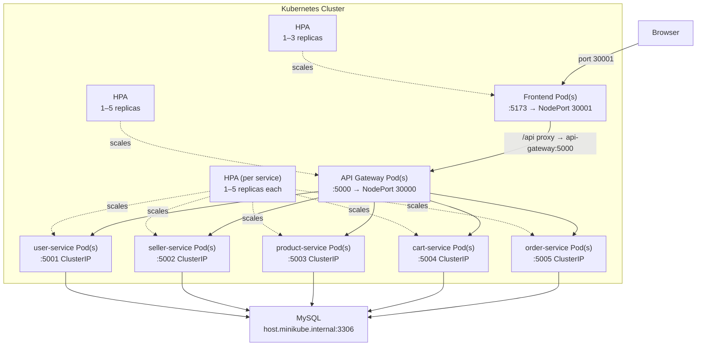

# Kubernetes Integration - Final Walkthrough

## What Was Built

A complete Kubernetes setup for the e-commerce microservices application with Horizontal Pod Autoscaling (HPA), layered on top of the existing Jenkins + Ansible + Docker CI/CD pipeline.

## Directory Structure

```
k8s/
├── configmap/
│   └── 01-config.yaml          # Generated by deploy.sh — gitignored
├── secret/
│   └── 02-secret.yaml          # Generated by deploy.sh — gitignored
├── deployment/
│   ├── 03-user-deploy.yaml
│   ├── 04-seller-deploy.yaml
│   ├── 05-product-deploy.yaml
│   ├── 06-cart-deploy.yaml
│   ├── 07-order-deploy.yaml
│   ├── 08-gateway-deploy.yaml
│   └── 09-frontend-deploy.yaml
├── service/
│   ├── 03-user-service.yaml
│   ├── 04-seller-service.yaml
│   ├── 05-product-service.yaml
│   ├── 06-cart-service.yaml
│   ├── 07-order-service.yaml
│   ├── 08-gateway-service.yaml
│   └── 09-frontend-service.yaml
├── hpa/
│   ├── 03-user-hpa.yaml
│   ├── 04-seller-hpa.yaml
│   ├── 05-product-hpa.yaml
│   ├── 06-cart-hpa.yaml
│   ├── 07-order-hpa.yaml
│   ├── 08-gateway-hpa.yaml
│   └── 09-frontend-hpa.yaml
└── deploy.sh                   # One-time setup script
```

> [!NOTE]
> `configmap/01-config.yaml` and `secret/02-secret.yaml` are **generated locally** by `deploy.sh` from your `.env` file. They are gitignored and never pushed to GitHub.

---

## Architecture



---

## HPA Overview

All deployments include CPU `requests` and `limits` so the HPA controller can calculate utilization:

| Service | Min Pods | Max Pods | CPU Trigger |
|---------|----------|----------|-------------|
| user-service | 1 | 5 | 50% of 100m |
| seller-service | 1 | 5 | 50% of 100m |
| product-service | 1 | 5 | 50% of 100m |
| cart-service | 1 | 5 | 50% of 100m |
| order-service | 1 | 5 | 50% of 100m |
| api-gateway | 1 | 5 | 50% of 100m |
| frontend | 1 | 3 | 50% of 100m |

> [!IMPORTANT]
> HPA requires the **Metrics Server** to be running. Enable it in Minikube with:
> ```bash
> minikube addons enable metrics-server
> ```
> Wait ~60 seconds after enabling before HPA shows real CPU values.

---

## Making deploy.sh Executable

Before running the deploy script for the first time, make it executable:

```bash
chmod +x k8s/deploy.sh
```

You only need to do this once. After that you can run it directly:

```bash
./k8s/deploy.sh
```

---

## First-Time Deployment

### Prerequisites
- Minikube running (`minikube start`)
- `kubectl` configured to use Minikube context
- MySQL running on your host with `ecommerce_solution` database initialized
- `.env` file in the project root with your credentials
- Metrics Server addon enabled (`minikube addons enable metrics-server`)

### Step-by-Step

```bash
# 1. Make the script executable (one-time only)
chmod +x k8s/deploy.sh

# 2. Run the deploy script — generates config/secret and applies everything
./k8s/deploy.sh

# 3. Wait for all pods to reach Running state
kubectl get pods --watch
# Press Ctrl+C when all 7 pods show STATUS: Running, READY: 1/1

# 4. Verify HPAs are active (may take ~60s for metrics to appear)
kubectl get hpa

# 5. Open the application
./k8s/setup-minikube-route.sh
# Open the printed link in your browser
```

---

## Day-to-Day Workflow

### Re-apply manifests after YAML changes (no .env change)

```bash
# Apply only the changed subdirectory
kubectl apply -f k8s/deployment/
kubectl apply -f k8s/service/
kubectl apply -f k8s/hpa/

# Or apply all at once (safe to re-run anytime)
kubectl apply -f k8s/configmap/
kubectl apply -f k8s/secret/
kubectl apply -f k8s/deployment/
kubectl apply -f k8s/service/
kubectl apply -f k8s/hpa/
```

### If .env changes (credentials, DB host, etc.)

```bash
# Re-run the deploy script to regenerate config/secret and re-apply everything
./k8s/deploy.sh
```

### Trigger a rolling update for a specific service

```bash
# Force pods to re-pull the latest image (no YAML change needed)
kubectl rollout restart deployment/user-service
kubectl rollout restart deployment/seller-service
kubectl rollout restart deployment/product-service
kubectl rollout restart deployment/cart-service
kubectl rollout restart deployment/order-service
kubectl rollout restart deployment/api-gateway
kubectl rollout restart deployment/frontend

# Or restart everything at once
kubectl rollout restart deployment
```

### Watch rollout progress

```bash
kubectl rollout status deployment/user-service
```

### Rollback a deployment

```bash
# Undo the last rollout for a specific service
kubectl rollout undo deployment/user-service

# Rollback to a specific revision
kubectl rollout undo deployment/user-service --to-revision=2

# View rollout history
kubectl rollout history deployment/user-service
```

---

## Kubernetes Monitoring & Debugging Commands

### kubectl get — Overview

```bash
# All pods with status and age
kubectl get pods

# All pods with node placement and IP
kubectl get pods -o wide

# Watch pods live (auto-refreshes)
kubectl get pods --watch

# All deployments (shows READY, UP-TO-DATE, AVAILABLE)
kubectl get deployments

# All services (shows ClusterIP/NodePort)
kubectl get services

# All HPAs — shows TARGETS, MINPODS, MAXPODS, REPLICAS
kubectl get hpa

# Watch HPA scaling in real time
kubectl get hpa --watch

# Everything at once
kubectl get all
```

### kubectl describe — Detailed Diagnostics

```bash
# Describe a pod — shows events, resource limits, env vars, restart reasons
kubectl describe pod <pod-name>

# Describe a deployment
kubectl describe deployment user-service

# Describe an HPA — shows current CPU usage, scale events
kubectl describe hpa user-service-hpa

# Describe a service — shows endpoints and selector
kubectl describe service user-service
```

### kubectl logs — Application Logs

```bash
# Last 50 lines from a deployment (picks any healthy pod)
kubectl logs deployment/user-service --tail=50

# Stream logs live
kubectl logs deployment/user-service -f

# Last 50 lines from a specific pod
kubectl logs <pod-name> --tail=50

# Logs from a crashed/previous container (useful after restarts)
kubectl logs <pod-name> --previous

# Logs from all pods of a deployment simultaneously
kubectl logs -l app=user-service --tail=20
```

### kubectl exec — Shell Into a Pod

```bash
# Open a shell inside a running pod
kubectl exec -it <pod-name> -- /bin/sh

# Run a one-off command inside a pod
kubectl exec <pod-name> -- env | grep DB
```

### kubectl top — Live Resource Usage

```bash
# CPU and memory usage per pod (requires metrics-server)
kubectl top pods

# CPU and memory usage per node
kubectl top nodes
```

### Other Useful Commands

```bash
# Delete a stuck pod (Kubernetes recreates it automatically)
kubectl delete pod <pod-name>

# Scale a deployment manually (HPA will override this if active)
kubectl scale deployment/user-service --replicas=3

# Edit a live resource in-cluster
kubectl edit deployment/user-service

# View events sorted by time (great for debugging scheduling issues)
kubectl get events --sort-by='.lastTimestamp'

# Delete everything and start fresh (⚠️ destructive — removes all resources)
kubectl delete -f k8s/hpa/
kubectl delete -f k8s/service/
kubectl delete -f k8s/deployment/
kubectl delete -f k8s/secret/
kubectl delete -f k8s/configmap/

# Then redeploy from scratch
./k8s/deploy.sh
```

---

## Minikube Commands

```bash
# Start the cluster
minikube start

# Stop the cluster (preserves state)
minikube stop

# Delete the cluster entirely (clean slate)
minikube delete

# Check cluster status
minikube status

# Enable the metrics-server addon (required for HPA)
minikube addons enable metrics-server

# List all enabled addons
minikube addons list

# Get the IP of the Minikube VM
minikube ip

# Get the frontend link without the Docker-driver tunnel warning
./k8s/setup-minikube-route.sh

# SSH into the Minikube node
minikube ssh

# View the Kubernetes dashboard in browser
minikube dashboard
```

---

## HPA Load Testing — Demonstration Steps

These steps show how to demonstrate HPA autoscaling behavior using a temporary load generator pod. **No script needs to be committed to the project** — all commands are run ad-hoc.

### Step 1 — Ensure Metrics Server is Running

```bash
minikube addons enable metrics-server

# Wait ~60 seconds, then verify HPA has real metrics (not <unknown>)
kubectl get hpa
```

Expected output when ready:
```
NAME                  REFERENCE                TARGETS   MINPODS   MAXPODS   REPLICAS
api-gateway-hpa       Deployment/api-gateway   2%/50%    1         5         1
cart-service-hpa      Deployment/cart-service  1%/50%    1         5         1
...
```

### Step 2 — Check Baseline (Before Load)

```bash
kubectl get hpa
kubectl get pods
```

All services should be at 1 replica with low CPU.

### Step 3 — Generate Load Against api-gateway

In **Terminal 1** — start the load generator (a BusyBox pod running wget in a loop).

**Option A — Light load using the health endpoint:**
```bash
kubectl run load-generator \
  --image=busybox:1.28 \
  --restart=Never \
  --rm -it \
  -- /bin/sh -c "while true; do wget -q -O- http://api-gateway:5000/api/health; done"
```

**Option B — Heavier load using a proxied service route (hits product-service + DB):**
```bash
kubectl run load-generator \
  --image=busybox:1.28 \
  --restart=Never \
  --rm -it \
  -- /bin/sh -c "while true; do wget -q -O- http://api-gateway:5000/api/products; done"
```

**Option C — Parallel load with multiple pods (most effective for triggering HPA):**
```bash
# Run 3 load generators simultaneously
for i in 1 2 3; do
  kubectl run load-generator-$i \
    --image=busybox:1.28 \
    --restart=Never \
    -- /bin/sh -c "while true; do wget -q -O- http://api-gateway:5000/api/products; done"
done
```

> [!IMPORTANT]
> The gateway's valid routes are: `/api/health`, `/api/auth`, `/api/products`, `/api/cart`, `/api/orders`, `/api/seller-auth`.
> Using `/health` (without `/api/`) will always return **404** and generate minimal CPU load.

### Step 4 — Watch HPA React (In Terminal 2)

```bash
# Watch HPA targets and replica counts update every 15 seconds
kubectl get hpa --watch
```

Within 1–2 minutes you should see the `TARGETS` column rise above 50% and `REPLICAS` increase:

```
NAME              REFERENCE             TARGETS    MINPODS  MAXPODS  REPLICAS
api-gateway-hpa   Deployment/api-gateway  87%/50%  1        5        3
```

```bash
# Also watch the new pods spin up
kubectl get pods --watch
```

### Step 5 — Stop the Load

Press **Ctrl+C** in Terminal 1 to stop the load generator. Clean up all load generator pods:

```bash
# Delete single load generator
kubectl delete pod load-generator

# Delete all parallel load generators (Option C)
kubectl delete pod load-generator-1 load-generator-2 load-generator-3

# Or delete all pods with the load-generator prefix at once
kubectl delete pod -l run=load-generator
```

### Step 6 — Watch Scale-Down

After load stops, HPA will scale back down after a cool-down period (~5 minutes by default):

```bash
kubectl get hpa --watch
```

CPU utilization will drop, and replica count will return to 1.

### Step 7 — Describe HPA for Event History

```bash
kubectl describe hpa api-gateway-hpa
```

This shows the full scaling event log — when scale-up and scale-down decisions were made.

---

## Rolling Updates (Zero Downtime)

When Jenkins builds and pushes a new image, update without downtime:

```bash
# Trigger a rolling update for a specific service
kubectl rollout restart deployment/user-service

# Watch it happen live
kubectl rollout status deployment/user-service

# Rollback if needed
kubectl rollout undo deployment/user-service
```

Strategy used: `maxUnavailable: 0, maxSurge: 1` — new pod must be healthy before old pod is removed.

---

## Verified Working State

```
NAME                               READY   STATUS    RESTARTS
api-gateway-c7bf9c887-277k5        1/1     Running   0
cart-service-5479f64d67-c7kjm      1/1     Running   0
frontend-8678c9c9d8-rws2z          1/1     Running   0
order-service-fb75d4759-j2465      1/1     Running   0
product-service-5645688b8b-9d7vr   1/1     Running   0
seller-service-79db57f64b-zj7qm    1/1     Running   0
user-service-785f8b55bb-bt7rj      1/1     Running   0
```

**DB connectivity:** `✓ MySQL Database connected successfully` (all services)

**Website access:** `http://192.168.49.2:30001`

---

## Key Design Decisions

| Decision | Reason |
|----------|--------|
| `host.minikube.internal` for DB_HOST | `host.docker.internal` doesn't resolve inside Minikube VMs |
| Auto-detection in `deploy.sh` | Works transparently on both Minikube and Docker Desktop |
| Generated config/secret (gitignored) | Each developer keeps their own `.env` — no credentials in git |
| `imagePullPolicy: Always` | Ensures Kubernetes always pulls the latest image on pod restart |
| Jenkins pushes both `:tag` and `:latest` | K8s deployments use `:latest` for simplicity |
| Nginx for Frontend | Replaces Vite dev server to fix `EMFILE` file-watcher crashes and improve performance |
| `autoscaling/v2` API for HPA | v2 is stable since Kubernetes 1.23 and supports multiple metric types |
| Resource `requests` on all containers | HPA calculates utilization as `current / request` — requests are mandatory |
| Subdirectory structure for k8s/ | Cleaner separation of concerns; allows applying subsets without affecting others |

---

## Frontend Production Build (EMFILE Fix)

The frontend deployment uses an optimized Nginx production server instead of the Vite dev server. This completely eliminates the file-watching mechanism that causes `EMFILE: too many open files` crashes in Kubernetes.

### Key Refactors
1. **`frontend/nginx.conf.template`**:
   - Listens on port `5173`.
   - Configures React Router fallback support (`try_files $uri $uri/ /index.html;`).
   - Uses a dynamic API proxy with Kubernetes DNS resolution to forward backend API calls to the `api-gateway`. Nginx automatically substitutes this using the `env` variables defined in `deployment/09-frontend-deploy.yaml`.
2. **`frontend/Dockerfile` Upgrade**:
   - Uses a **Multi-Stage Build**.
   - **Stage 1 (builder)**: Installs dependencies and runs `npm run build` to create static assets.
   - **Stage 2**: Copies only the built assets and Nginx configuration into a lightweight Nginx container.

### Deploying Frontend Changes
Whenever you update the frontend, manually build and push the new image:
```bash
cd frontend
docker build -t jilspatel/frontend:latest .
docker push jilspatel/frontend:latest

# Restart the pods to pull the new image
kubectl rollout restart deployment frontend
```
